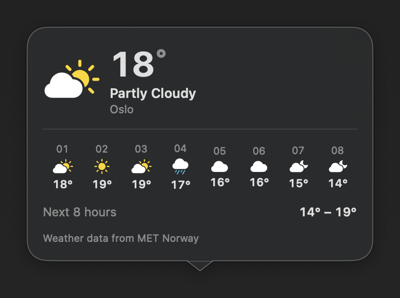
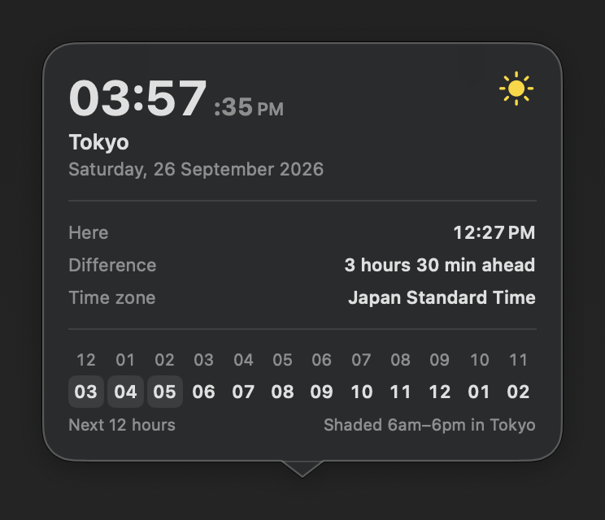
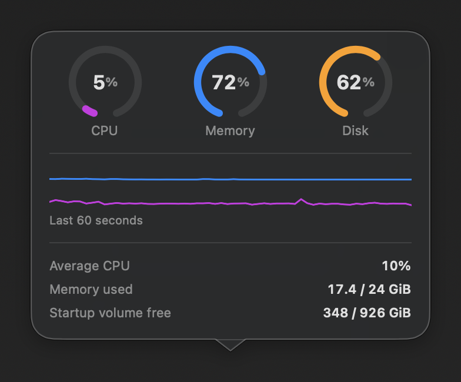
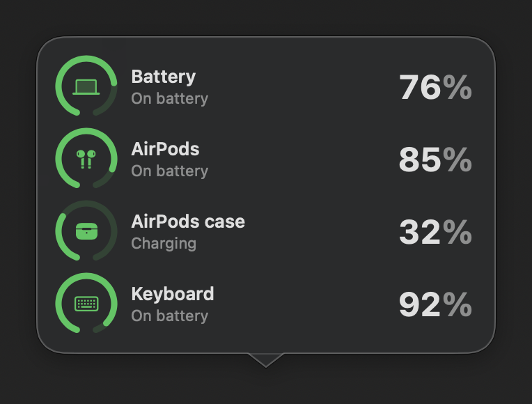
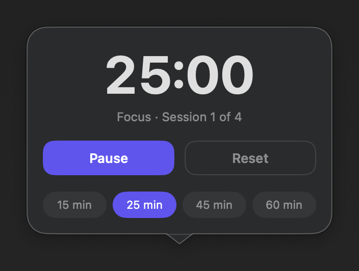
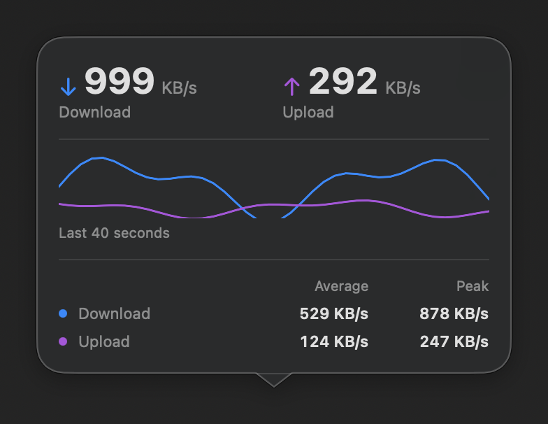
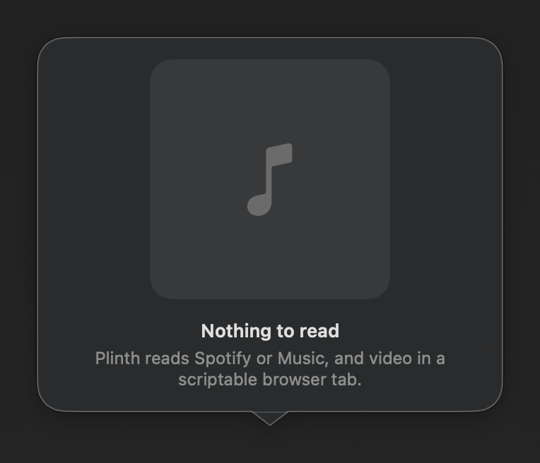
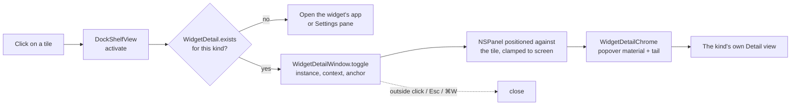

<div align="center">

# Plinth

**A free, open-source shelf for the macOS Dock — live widgets, app groups and
folders in a strip that sits beside Apple's Dock, or stands in for it.**

[](#building-from-source)
[](project.yml)
[](.github/workflows/ci.yml)
[](#tests)
[](LICENSE)

</div>

---

## Standing on Dockset's shoulders

Plinth exists because of **[Dockset](https://dockset.app)**, a genuinely lovely
macOS app built and sold by an independent developer. Dockset is the original:
it is the app that worked out what a Dock shelf should feel like, and it is
polished, supported and worth paying for. **If you want the real article, go and
buy it** — that is the version with a person behind it who will answer your
email.

Plinth is an independent reimplementation, written from scratch as a homage and
a way of learning how something like this is actually built. It is a hobby
project with rough edges. It is **not affiliated with, endorsed by, sponsored by
or connected to Dockset**, it is not "the free version" of it, and it is not
trying to replace or compete with it. No Dockset code, artwork, screenshots,
copy or branding is used here; everything below was written and drawn
independently.

The full attribution, including the two specific design decisions this project
learned by looking at Dockset, is in **[NOTICE.md](NOTICE.md)**.

---

## Panels

Clicking a widget opens a detail panel, anchored to the tile it came from, with
a tail pointing back at it. These are captures of the real views, not mockups —
but read the captions, because some of them are the widget library's sample data
rather than a live reading.

<table>
  <tr>
    <td width="33%" valign="top">
      <br>
      <sub><b>Weather</b> — MET Norway forecast. <i>Sample data</i> (Oslo), not a live reading.</sub>
    </td>
    <td width="33%" valign="top">
      <br>
      <sub><b>World clock</b> — live: real clock, real zone arithmetic.</sub>
    </td>
    <td width="33%" valign="top">
      <br>
      <sub><b>System activity</b> — live CPU, memory and disk; the graph is a genuinely sampled minute.</sub>
    </td>
  </tr>
  <tr>
    <td valign="top">
      <br>
      <sub><b>Battery</b> — the Mac and its accessories. <i>Sample data</i>, not real devices.</sub>
    </td>
    <td valign="top">
      <br>
      <sub><b>Focus timer</b> — live: a real 25-minute session, one second in.</sub>
    </td>
    <td valign="top">
      <br>
      <sub><b>Network</b> — throughput up and down. <i>Sample series</i>, not live traffic.</sub>
    </td>
  </tr>
  <tr>
    <td valign="top">
      <br>
      <sub><b>Now Playing</b> — the honest empty state. Reading a player needs Automation consent, which the capture tool does not have, so this is what you get when nothing can be read.</sub>
    </td>
    <td colspan="2" valign="top">
      <sub>Captured by <a href="scripts/capture-shots.sh"><code>scripts/capture-shots.sh</code></a>, which builds a small <code>Shots</code> target, puts each panel in a real window on a real display and screenshots it. The panels sit on a behind-window vibrancy material, so an offscreen render would not be the same picture — it has to be genuinely on screen to have anything to sample.</sub>
    </td>
  </tr>
</table>

---

## What it does

### It follows your real Dock instead of copying it

Size, edge, magnification and auto-hide are read live from `com.apple.dock`, and
the shelf subscribes to the `com.apple.dock.prefchanged` notification the Dock
posts when any of them change. Drag the size slider in System Settings and the
shelf moves with it — there is nothing to keep in sync, and no second set of
preferences asking you questions macOS already asked. Every read is defensive
and falls back to Apple's own defaults, because the domain is public but its
schema is not documented. Your pinned apps are mirrored the same way, so pinning
an app in the real Dock puts it on the shelf immediately.

Resize the shelf by dragging it and only the *size* stops following. The edge
and the hiding still do.

### Magnification with Apple's own curve

`Geometry.influence` is a raised-cosine falloff: `(1 + cos(πd/r)) / 2`, which is
1.0 under the pointer, 0 at the radius, and — the part that matters — has zero
slope at *both* ends, so there is no visible seam where the effect stops. A
linear ramp makes neighbours lurch as the pointer crosses them; a gaussian never
quite reaches zero, so icons three tiles away drift for no reason. Peak and
radius come from your own `largesize` and `tilesize` rather than from a constant.

### Widgets

Twenty-four kinds in the catalog. Seventeen draw a live tile today — clock,
world clock, stopwatch, focus timer, progress through the day, countdown, alarm,
hydration, sticky notes, battery, system activity, network, AirDrop, stocks,
watchlist, weather and Now Playing. The other seven show a labelled placeholder
tile (see [Known limits](#known-limits)).

Twenty-two of the twenty-four open a **detail panel** when clicked — a vibrant
`.popover`-material panel anchored to the tile, with a tail pointing at it,
dismissed by clicking outside, Escape, or ⌘W. Calendar and Reminders have full
panels even though their tiles are still placeholders, and ask for Calendars and
Reminders access only when you open them, never at launch.

They are usable, not just readable: timers start and stop, the countdown
restarts, notes are typed in place, the alarm toggles, and the metric, span and
symbol tiles page through what they show.

### Now Playing scripts the players, because the framework is gated

The obvious route is `MediaRemote`, and it has been entitlement-gated since
macOS 15.4 — it loads, the symbols resolve, and it returns nothing to an
unsigned caller. So Plinth asks the players directly over Apple Events: Spotify
and Apple Music first, then whatever a scriptable browser tab is playing
(Safari, Brave, Helium and Dia — Firefox ships no scripting dictionary at all,
so there is nothing there to address). Browsers are addressed by bundle
identifier, never by name, because `application "Brave Browser"` can resolve to
a fork that inherited the LaunchServices name. Nothing here ever launches a
player: an app that is not already running is skipped.

### App groups

Drop one icon onto another and hold for a moment, the way iOS makes a folder.
Tinted, named, opening into a panel you can drag icons back out of, with a 2×2
preview grid in a single Dock slot. A group left holding one item gives way to
that icon.

### And the rest

Overflow scrolling with the trackpad, drag to reorder anywhere in the row, the
launch bounce, folders and files alongside apps, and saved layouts that can be
written back to Apple's real Dock — only `persistent-apps`, never your stacks or
recents, with verification and a rollback if the Dock comes back wrong.

---

## Install

### Download a build

Grab the latest `.zip` from the
[Releases page](https://github.com/nparashar150/dockset.app/releases), unzip it
and move `Plinth.app` to `/Applications`. If there is no release there yet,
build from source — it takes about a minute.

**Builds are unsigned and not notarised**, because notarisation needs a paid
Apple Developer account. macOS 26 will refuse the first launch with a dialog
saying it cannot verify the app is free of malware. The way through:

1. Double-click the app, get the refusal, dismiss it.
2. **System Settings ▸ Privacy & Security ▸ Security** — there is now an
   **Open Anyway** button for Plinth.
3. Click it, authenticate, launch again and confirm.

Control-click ▸ Open stopped working for this in Sequoia and is not the route on
macOS 26. If you would rather do it from a terminal:
`xattr -dr com.apple.quarantine /Applications/Plinth.app`.

### Building from source

Requires macOS 26 and Xcode. The Xcode project is generated from `project.yml`
and is not in the tree:

```sh
brew install xcodegen
xcodegen generate
xcodebuild -scheme Plinth -configuration Release build
```

`project.yml` pins a specific signing identity and team. Replace
`CODE_SIGN_IDENTITY` and `DEVELOPMENT_TEAM` with your own, or build ad-hoc with
`CODE_SIGN_IDENTITY: "-"` — but note that macOS will not offer location consent
to an ad-hoc binary at all, because there is no stable identity to attach the
grant to. [CONTRIBUTING.md](CONTRIBUTING.md) has the details.

### First run

Plinth is an `LSUIElement` accessory app: **no Dock tile and no app window of its own**. Its
only permanent UI is the status item in the menu bar, which is where the
settings, the widget library and the profile switcher live. If it looks like
nothing happened, look up.

---

## Architecture

```
Sources/
  App/         AppState — the single source of truth: persisted state, the one
               1s tick every time-based widget reads, and the only path that
               writes Apple's Dock. Plus the app entry point and window owners.
  Core/        Pure value types and maths. Geometry (layout, magnification,
               springs), Models (items, groups, widgets, profiles), Persistence,
               and the macOS Dock tile encoding. No AppKit state, so it is the
               part the tests can compile directly.
  DockPanel/   The shelf itself: the NSPanel and its controller, the SwiftUI
               row, tiles, drag and drop, group windows, tooltips, the vibrancy
               background, and the scroll relay.
  Widgets/     The widget catalog, the tile for each kind (Kinds/), the detail
               panel for each kind (Details/), and the shared chrome.
  Services/    Everything that talks to the outside world: system metrics,
               battery, network, weather, stocks, music, browsers, the app
               catalog, location, and the com.apple.dock reader.
  MenuBar/     The status item, its menu, and the settings surfaces.
  NativeDock/  The actor that reads and writes Apple's real Dock.
```

How a click on a widget reaches its panel:



The one structural rule worth knowing: types that need testing live in files the
test target compiles. `PlinthTests` builds `Sources/Core` plus four named files
rather than hosting the app, so a helper that belongs in a test lives in, say,
`DockLayout.swift` — that is why `KeyablePanel` is where it is.

---

## Tests

**241 tests, and almost all of them exist because something broke.**

```sh
xcodegen generate
xcodebuild -scheme PlinthTests -configuration Debug test
```

The coordinate conversions have the most coverage, because that was the most
repeated defect: the shelf sits centred inside a panel longer than itself, and
converting between a screen position and a position along the row needs that
inset. The hover label pointed at the wrong icon, then the drop gap opened away
from the pointer, then the two drifted apart again. The suite asserts the round
trip — a slot centre taken out and brought back must return that slot.

`InteractionTests` deliver real `NSEvent`s to a window. The worst defects here
were all "the click never arrived", and none of them were visible in the layout
maths: an empty content shape removed every widget's controls from hit testing,
a borderless panel could not take a keystroke, and a non-key window swallowed
the first press. No assertion on a value catches any of that.

The test target compiles only the pure core, so a break in `Sources/App`,
`Sources/Widgets` or `Sources/DockPanel` will never reach it — which is why CI
builds the app and runs the tests as two separate steps.

---

## Known limits

- **Seven widget kinds are placeholders.** Calendar, Reminders, AI usage,
  Shortcut, Stripe, Paddle and Shopify render a labelled "not yet" tile instead
  of a real one. Calendar and Reminders do have working detail panels; the other
  five do not have a real tile yet.
- **The revenue widgets have no service behind them.** Stripe, Paddle and
  Shopify are all network-backed and this build ships no client for any of them.
  Their panel deliberately states that it is unconnected rather than drawing a
  plausible figure — a made-up amount under a real account name is
  indistinguishable from a working widget, and that is the one failure a money
  readout cannot afford.
- **Location consent is not reachable.** The weather widget asks CoreLocation
  for your city; macOS does not present the prompt to an accessory app with no
  ordinary window, and promoting the app to `.regular` first — which is what
  makes the Apple Events prompt appear — does not change it. Set a city in
  Settings ▸ Widgets instead.
- **Apple Events need consent.** Reading Spotify, Music or a browser tab
  requires approving Plinth under Privacy & Security ▸ Automation, and the
  browser fallback additionally needs "Allow JavaScript from Apple Events" in
  that browser's Develop menu.
- **Removal uses a deprecated API on purpose.** `NSAnimationEffect` is the
  Dock's own poof, and Apple withdrew it suggesting a *cursor* as the
  replacement. It still renders, and a real poof beats a hand-drawn puff of
  smoke.
- **Builds are unsigned.** Every download walks the Privacy & Security path
  above. Building from source with your own certificate is the way around it.

---

## Contributing

Bug reports and pull requests are welcome. [CONTRIBUTING.md](CONTRIBUTING.md)
covers the build, the signing situation, what the test target can and cannot
see, and the house rules — the main one being that comments explain *why*, never
*what*.

## Credits

- **[Dockset](https://dockset.app)** — the original, and the reason this exists.
  Please go and buy it. Full attribution in [NOTICE.md](NOTICE.md).
- Weather data from **[MET Norway](https://api.met.no/)**, used under CC BY 4.0.
- Built with **[XcodeGen](https://github.com/yonaskolb/XcodeGen)**.
- No bundled dependencies. Everything else is Apple's own frameworks.

## Licence

[MIT](LICENSE). Third-party attributions and trademark notices are in
[NOTICE.md](NOTICE.md).
